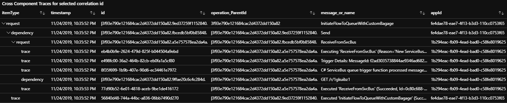

# Cross Component Correlation Playground

The Cross Component Correlation Playground is a setup which allows for testing a variety of distributed tracing scenarios across a number of components in Azure, amongst which:
- Functions
- Logic Apps
- Azure Service Bus
- Event Grid

It does so by providing real working examples and associated instructions for a number of distributed tracing scenarios.

## How does correlation work?

See: 
- https://docs.microsoft.com/en-us/azure/azure-monitor/app/auto-collect-dependencies
- https://docs.microsoft.com/en-us/azure/azure-monitor/app/correlation
- http://apmtips.com/blog/2017/10/18/two-types-of-correlation/
- https://dev.applicationinsights.io/
- https://devblogs.microsoft.com/aspnet/improvements-in-net-core-3-0-for-troubleshooting-and-monitoring-distributed-apps/
- https://docs.microsoft.com/en-us/azure/logic-apps/logic-apps-monitor-your-logic-apps#azure-diagnostics-event-settings-and-details

## Scenarios

### Fn A -> Service Bus

**Scenario**: Function A submits message into Service Bus Queue

- no custom correlation code in function
- no special configuration on Service Bus

**Results**: 

Works out of box

- Submission Id:        7eaeb56f-1a9f-451f-9e55-ffc54acc12e7
- Fn request properties in App Insights (telemetrytype: 'request'):
  - Request Id:         |c2314dd473c52c43869c75125cc5a583.025ecd4141103743.
  - Operation Id: 	    c2314dd473c52c43869c75125cc5a583
  - Parent Id:          c2314dd473c52c43869c75125cc5a583
  - Custom properties
    - HostInstanceId:   7d0dd5e9-6b9a-4643-b30b-432758cedc45
    - InvocationId: 	b45af8f8-9a7f-417c-bc78-7b3c07d946b5
- Svc bus dep properties in App Insights (telemetrytype: 'dependency'):
  - Dependency Type:    Azure Service Bus
  - Operation Id:       c2314dd473c52c43869c75125cc5a583
  - Parent Id:          |c2314dd473c52c43869c75125cc5a583.025ecd4141103743.
  - Dependency Id:      |c2314dd473c52c43869c75125cc5a583.0ab2335a5550cd4c.
  - Custom properties:
    - HostInstanceId:   7d0dd5e9-6b9a-4643-b30b-432758cedc45
    - InvocationId:     b45af8f8-9a7f-417c-bc78-7b3c07d946b5

**View in App Insights**

### Fn A -> Service Bus -> Fn B

**Scenario**: Same as previous scenario, but now there is another function linked to another App Insights resource, which receives the message
- no custom correlation code in function
- no special configuration on Service Bus

Note how this scenario is not officially supported, [as documented here](https://docs.microsoft.com/en-us/azure/azure-monitor/app/custom-operations-tracking#queue-instrumentation)

**Results**: 

Fn B logs the invocation to app insights but does not mention or show a correlation or dependency to the service bus queue or message
However, there IS a correlation to be found in the properties.  Notice how the request on AI B has a `Parent Id` which is equal to AI A `Dependency Id`.  The UI or map on either side though does not show this correlation between both.

- Submission Id:        7eaeb56f-1a9f-451f-9e55-ffc54acc12e7
- Fn request properties in App Insights (telemetrytype: 'request'):
  - TriggerReason:      New ServiceBus message detected on 'aicorr-svcbusqueue'.
  - Request Id:         |c2314dd473c52c43869c75125cc5a583.1347ee1852a3504b.
  - Operation Id: 	    c2314dd473c52c43869c75125cc5a583
  - Parent Id:          |c2314dd473c52c43869c75125cc5a583.0ab2335a5550cd4c.
  - Request Source:	    type:Azure Service Bus | name:aicorr-svcbusqueue | endpoint:sb://aicorr-svcbusns.servicebus.windows.net/
  - Custom properties
    - HostInstanceId:   880449e7-fef4-4a50-8cad-369f36c5d598
    - InvocationId: 	a4d65d54-1688-4b70-abc7-44efd1433afe
    - MessageId:        0edeaa16c20f4f3698b4bf49ff3d6721

**How this works**:

Azure Functions records metadata on the service bus message, most in particular:
- `$AzureWebJobsParentId` is set to the `InvocationId` of the dependency entry (which in turn is also the same as the request entry - as the InvocationId indicates the unique invocation identifier of the function)
- `Diagnostic-Id` is set to the `Dependency Id` of the dependency entry of the function which submitted the message
- Function B takes this `DiagnosticId` metadata and uses that as it's `Parent Id`

### Recording custom telemetry on a function invocation's telemetry

Recording custom properties on the telemetry created during a function invocation is as easy as:

~~~cs
using System.Diagnostics;
// ...
Activity currActivity = Activity.Current;
currActivity.AddTag("MySubmissionId", submissionId);
~~~

Note: this records the custom property on the `request` telemetry item not on any dependency items this invocation created.

### Function making HTTP call

The interesting properties that appear as headers on the outbound HTTP call are:

| Header                   | Value                                                       | Comment                                          |
| ------------             | -----------------------------------                         | ------------------------------------             |
| **TraceParent**          | **00-2ba1dcbb920c0c489823e86ee57e557d-82c588a5d78c3f4a-00** | is the new W3C trace context                     |
| **Request-Id**           | **\|2ba1dcbb920c0c489823e86ee57e557d.82c588a5d78c3f4a.**    | is the older "request-id" mechanism              |
| **Request-Context**      | **appId=cid-v1:6b06625e-3d1f-4bb4-8b50-b22b20b5a6d6**       | represents the app id for AI A                   |
| X-Request-Id             | c39043fc-5693-4ca6-ba3c-56cf059acbad                        | NOT important to the discussion - IGNORE THIS    | 

> Note: `X-Request-Id` is an older concept, originally intended to flow custom correlation id between client and server for HTTP calls.  It is not important to the discussion here.  Please ignore.

> Our application id for App Insights A == 6b06625e-3d1f-4bb4-8b50-b22b20b5a6d6)
> 
> Application Id is also returned in the response header request-context to a http function invocation
> Because this value is obtained (non blocking) by the runtime the first few calls may not return it.
> Ref https://github.com/microsoft/ApplicationInsights-dotnet-server/issues/504

... and what we see on App Insights:

Request telemetry item:

| Property                 | Value                                                   |
| ------------             | -----------------------------------                     |
| OperationId              | 2ba1dcbb920c0c489823e86ee57e557d                        |
| ParentId                 | 2ba1dcbb920c0c489823e86ee57e557d                        |
| Request-Id               | \|2ba1dcbb920c0c489823e86ee57e557d.509b52d5c4ba6145.    |
| (custom) HostInstanceId  | 0a57ccf6-58ea-4392-9da0-aaf0c043715a                    |
| (custom) InvocationId    | f860490b-30c2-4cb7-8688-10076b02ba7d                    |

Dependency telemetry item:

| Property                 | Value                                                   |
| ------------             | -----------------------------------                     |
| Remote Dependency Name   | GET /r/1ccpqtm1                                         |
| Operation Id             | 2ba1dcbb920c0c489823e86ee57e557d                        |
| Parent Id                | \|2ba1dcbb920c0c489823e86ee57e557d.509b52d5c4ba6145.    |
| **Dependency Id**        | \|2ba1dcbb920c0c489823e86ee57e557d.82c588a5d78c3f4a.    |
| (custom) HostInstanceId  | 0a57ccf6-58ea-4392-9da0-aaf0c043715a                    |
| (custom) InvocationId    | f860490b-30c2-4cb7-8688-10076b02ba7d                    |

**How this works**:

This means that the dependency telemetry item's `Dependency Id` is set on the outbound HTTP call's `TraceParent` and `Request-Id` so it can be picked up by the receiver.  In addition to this parent/child relation, also the identifier for the caller's App Insights resource (**appId**) is passed on in the HTTP call in the `Request-Context` header.  This is to enable cross-workspace discovery to power tooling with like the app map.

### Fn A -> Service Bus -> Fn B (with custom code to correlate across workspaces using a custom correlation id)

When using the `Activity` class to add custom properties to the recorded telemetry, one can also use the `Activity Bagage` to indicate any information to be passed on to all dependencies.  To pass on a custom property to a dependency:

~~~cs
  using System.Diagnostics;
  // ...
  Activity currActivity = Activity.Current;
  currActivity.AddBaggage("MySubmissionIdThroughBagage", submissionId);
~~~

Note how the call to `Activity.AddTag(..)` did _not_ result in anything being recorded on the dependency telemetry item.  Also, when used in our Function to enqueue an item, the metadata on that item would not show those tags.  This is different for `Activity.AddBagage`.  The enqueued message in this case, shows metadata like:

| Property                 | Value                                                               |
| ------------             | -----------------------------------                                 |
| Correlation-Context      | MySubmissionIdThroughBagage=bec20faa-9fa1-4dfc-a081-9b32a52dbdac    |

This mechanism works: 
- despite that the Functions ServiceBus binding does not call into App Insights directly (it just uses the Service Bus SDK)
- despite the fact that the Service Bus SDK does not know anything about our application context

On the side of App Insights, for the request telemetry item nothing will have changed but the following is what we see for the dependency telemetry item:

| Property                                  | Value                                   |
| ------------                              | -----------------------------------     |
| (custom) MySubmissionIdThroughBagage      | bec20faa-9fa1-4dfc-a081-9b32a52dbdac    |

What if FunctionB now picks up this message from the queue?  This mechanism will propagate this property to the receiving invocating for FunctionB, which (thanks to the Service Bus SDK) will record the very same property in its request telemetry item:

| Property                                  | Value                                   |
| ------------                              | -----------------------------------     |
| (custom) MySubmissionIdThroughBagage      | bec20faa-9fa1-4dfc-a081-9b32a52dbdac    |

Even beyond this... if FunctionB does an outbound HTTP calls, that custom metadata will also travel in the headers of such outbound call.

> **Note**: the App Insights treeview and app map will still _not_ show a consolidated view out of the box when _just_ doing Fn A -> SvcBus -> Fn B.  It has no idea which workspaces to link up.  However, as soon as one does an HTTP call from Fn A to Fn B, the **appId** of both workspaces are exchanged and App Insights will start lighting up the consolidated experience!  Like this:
>
> 

### Using Kusto to correlate items with a custom correlation ID

You could write a Kusto query as below to find telemetry with a custom correlation ID, within a single App Insights component/workspace:

~~~kusto
(requests | union dependencies | union pageViews)
| extend MyCustomCorrId = tostring(customDimensions.MyCustomCorrId) 
| where  MyCustomCorrId == "7d767f42-3e80-4e4e-9d40-44edb59af6f3"
~~~

To do the same across workspaces, [see the documentation for this](https://docs.microsoft.com/en-us/azure/azure-monitor/log-query/cross-workspace-query#identifying-an-application).  This could look something like:

~~~kusto
let allApps = union app('aicorr-fn-appinsights-a').requests, app('aicorr-fn-appinsights-b').requests,
              app('aicorr-fn-appinsights-a').dependencies, app('aicorr-fn-appinsights-b').dependencies,
              app('aicorr-fn-appinsights-a').exceptions, app('aicorr-fn-appinsights-b').exceptions,
              app('aicorr-fn-appinsights-a').traces, app('aicorr-fn-appinsights-b').traces,
              app('aicorr-fn-appinsights-a').customEvents, app('aicorr-fn-appinsights-b').customEvents;
allApps
| extend MyCustomCorrId = tostring(customDimensions.MyCustomCorrId) 
| where  MyCustomCorrId == "7d767f42-3e80-4e4e-9d40-44edb59af6f3"
| order by timestamp asc
~~~

- notice how the very first function call is _not_ present; which is because we only set the baggage _within_ that activity, when it already started.  Any activities that started after we set the baggage got the custom correlation id stamped on them and as such are retrieved by the query
- to mitigate this, you'll want to stamp the original request with a tag, in additional to the baggage, like the below.  The above query would not need to be changed for this.

~~~cs
currActivity.AddTag("MyCustomCorrId", submissionId);
~~~

### Function -> Logic App (no custom modifications)

When function A makes a call to logic App A, the logic app manual trigger (called through an HTTP POST) will have access to the inbound headers, which it will see like:

~~~json
{
    "headers": {
        "Host": "prod-105.westeurope.logic.azure.com",
        "Request-Context": "appId=cid-v1:fe4dae78-eae7-4f13-b3d3-110cc0753f65",
        "traceparent": "00-bb375af0c4f6a24ab36915f13be7d08d-334f3f2baa66b042-00",
        "Request-Id": "|bb375af0c4f6a24ab36915f13be7d08d.334f3f2baa66b042.",
        "Content-Length": "0"
    }
}
~~~

Out of box, the logic app does nothing to put a valid correlation in Log Analytics which is usable to tie both the Function and Logic App traces together.

### Function -> Logic App (custom property tracking)

We can modify the logic app so that a custom property gets tracked.  
For more information, see here: https://docs.microsoft.com/en-us/azure/logic-apps/logic-apps-monitor-your-logic-apps#azure-diagnostics-event-settings-and-details

#### Querying Log Analytics for custom tracked properties

In Log Analytics, you can query for `ActionCompleted` events where the tracked properties are stored:

~~~kusto
AzureDiagnostics
| where OperationName == "Microsoft.Logic/workflows/workflowActionCompleted" 
~~~

#### Extracting custom tracked properties in a column using Log Analytics

In order to extract tracked properties, a query like the below can be used:

~~~kusto
workspace('{logAnalytics}').AzureDiagnostics
| where OperationName == "Microsoft.Logic/workflows/workflowActionCompleted"
| parse kind = regex trackedProperties_Correlation_Context_s with * "MyCustomCorrId=" CustomCorrId:string
| project-reorder  CustomCorrId, trackedProperties_Correlation_Context_s
~~~

#### Correlating all Logic Apps Actions when correlation ids are just tracked on a single Action

In the end, one will want to retrieve the telemetry for all Logic Apps action that belong to the same run, even if custom tracked (correlation) properties were just tracked on a single action.

The raw logic apps diagnostics table looks like this:

~~~kusto
let LogicAppsDiagsRaw = 
  workspace('{logAnalytics}').AzureDiagnostics
  | project-reorder startTime_t, status_s, OperationName, trackedProperties_Correlation_Context_s, trackedProperties_Request_Id_s, resource_runId_s;
LogicAppsDiagsRaw
~~~

As demonstrated by above picture, there is only some entries that have a `trackedProperties_Correlation_Context_s` or `trackedProperties_Request_Id_s`.  Eventually though, one will want to be able to query for all the Logic Apps Actions that belong to the same run which is associated with a given correlation id.  In this example, that correlation id however is only tracked by a single activity within the run.  This means we'll need to find a way to "stamp" those correlation identifiers on all action telemetry.

First, we'll need to:
- look at the `workflowActionCompleted` entries which are the only ones which have tracked properties stored upon them
- then extract our custom correlation id from the Correlation Context column
- we'll also want to have an `id` column which uniquely identifies each Action
- finally we'll want to have a `operation_ParentId` similar to the output we typically see from App Insights so it becomes easier to union these tables later on

Like this:

~~~kusto
let LogicAppsActionCompletedDiag = 
  LogicAppsDiagsRaw
  | where OperationName == "Microsoft.Logic/workflows/workflowActionCompleted"
  | parse kind = regex trackedProperties_Correlation_Context_s with * "MyCustomCorrId=" MyCustomCorrId:string
  | extend id=resource_runId_s
  | project-rename operation_ParentId=trackedProperties_Request_Id_s
  | project-reorder  MyCustomCorrId, operation_ParentId, trackedProperties_Correlation_Context_s;
LogicAppsActionCompletedDiag
~~~

Now, we first create a lookup table, which maps each Logic App Run identifier to our custom correlation id and the `operation_ParentId` (which is coming from `trackedProperties_Request_Id_s`).  As follows:

~~~kusto
let MyCustomCorrIdMappingToResourceRunId = 
  LogicAppsActionCompletedDiag | where MyCustomCorrId != '' | distinct MyCustomCorrId, resource_runId_s, operation_ParentId;
MyCustomCorrIdMappingToResourceRunId
~~~

If we now have a `resource_runId_s` (which is available on every Action telemetry row), we can easily look up both the associated custom correlation id _and_ the `operation_ParentId`.  We can easily do this using the `lookup` function, for every single row in the raw Logic Apps Diagnostics table:

~~~kusto
let LogicAppsDiagsWithCustomCorrIdStamped = 
  LogicAppsDiagsRaw
  | lookup kind=leftouter MyCustomCorrIdMappingToResourceRunId on resource_runId_s
  | project-reorder MyCustomCorrId, resource_runId_s, trackedProperties_Correlation_Context_s, operation_ParentId, trackedProperties_Request_Id_s;
LogicAppsDiagsWithCustomCorrIdStamped
~~~

With a bit more ordering and cosmetics the entire query looks like this:

~~~kusto
let LogicAppsDiagsRaw = 
  workspace('{logAnalytics}').AzureDiagnostics
  | project-reorder startTime_t, status_s, OperationName, trackedProperties_Correlation_Context_s, trackedProperties_Request_Id_s, resource_runId_s;
let LogicAppsActionCompletedDiag = 
  LogicAppsDiagsRaw
  | where OperationName == "Microsoft.Logic/workflows/workflowActionCompleted"
  | parse kind = regex trackedProperties_Correlation_Context_s with * "MyCustomCorrId=" MyCustomCorrId:string
  | extend id=resource_runId_s
  | project-rename operation_ParentId=trackedProperties_Request_Id_s
  | project-reorder  MyCustomCorrId, operation_ParentId, trackedProperties_Correlation_Context_s;
let MyCustomCorrIdMappingToResourceRunId = 
  LogicAppsActionCompletedDiag | where MyCustomCorrId != '' | distinct MyCustomCorrId, resource_runId_s, operation_ParentId;
let LogicAppsDiagsWithCustomCorrIdStamped = 
  LogicAppsDiagsRaw
  | lookup kind=leftouter MyCustomCorrIdMappingToResourceRunId on resource_runId_s
  | project-reorder MyCustomCorrId, resource_runId_s, trackedProperties_Correlation_Context_s, operation_ParentId, trackedProperties_Request_Id_s;
let AllLogicActionsWithFilledCorrelationIds =
  LogicAppsDiagsWithCustomCorrIdStamped
  | extend id=resource_runId_s
  | project-reorder  MyCustomCorrId, operation_ParentId, resource_runId_s, operation_ParentId, trackedProperties_Correlation_Context_s;
AllLogicActionsWithFilledCorrelationIds
~~~

## Visualization using Log Analytics Workbooks

Where the built-in visualization and default queries of both Log Analytics and App Insights might fall a bit short for doing end to end correlation across a variety of resource types, Log Analytics Workbooks might be able to help.

### Using a treeview to visualize distributed traces across App Insights resources

Using a query like this:

~~~kusto
let allApps = union app('{appInsightsA}').requests, app('{appInsightsB}').requests,
              app('{appInsightsA}').dependencies, app('{appInsightsB}').dependencies,
              app('{appInsightsA}').exceptions, app('{appInsightsB}').exceptions,
              app('{appInsightsA}').traces, app('{appInsightsB}').traces,
              app('{appInsightsA}').customEvents, app('{appInsightsB}').customEvents;
allApps 
  | extend MyCustomCorrId = tostring(customDimensions.MyCustomCorrId) 
  | extend message_or_name = strcat(message, name)
  | extend id = iif(id == '', tostring(new_guid()), id) // make sure id is unique (if not table will not be displayed correctly)
  | where  MyCustomCorrId == "{corrid}"
  | project-reorder timestamp, itemType, id, operation_ParentId, message_or_name, appId
  | project-away problemId, handledAt, assembly, method, outerType, outerMessage, outerAssembly, outerMethod, innermostType, innermostMessage, innermostAssembly, innermostMethod, client_City, client_StateOrProvince, client_CountryOrRegion, client_Browser, cloud_RoleName, cloud_RoleInstance, client_Model, client_OS, operation_SyntheticSource, session_Id, user_Id, user_AuthenticatedId, user_AccountId, application_Version, client_Type, message, name
  | order by timestamp asc;
~~~

and configuring the workbook to visualize the table columns as follows:

will provide us with the ability to see a full treeview of our distributed trace.  In this particular case, we're looking at a trace that spans:
- a request coming in on Function App A
- which sends a message to Service Bus
- which gets picked up by Function App B
- which does an HTTP call to some external system

### Extending a distributed trace treeview with Action telemetry from Logic Apps

Building upon the previous treeview, we can extend our query to include data from Logic Apps.

~~~kusto
let allApps = union app('{appInsightsA}').requests, app('{appInsightsB}').requests,
              app('{appInsightsA}').dependencies, app('{appInsightsB}').dependencies,
              app('{appInsightsA}').exceptions, app('{appInsightsB}').exceptions,
              app('{appInsightsA}').traces, app('{appInsightsB}').traces,
              app('{appInsightsA}').customEvents, app('{appInsightsB}').customEvents;
let LogicAppsDiagsRaw = 
  workspace('{logAnalytics}').AzureDiagnostics
  | project-reorder startTime_t, status_s, OperationName, trackedProperties_Correlation_Context_s, trackedProperties_Request_Id_s, resource_runId_s;
let LogicAppsActionCompletedDiag = 
  LogicAppsDiagsRaw
  | where OperationName == "Microsoft.Logic/workflows/workflowActionCompleted"
  | parse kind = regex trackedProperties_Correlation_Context_s with * "MyCustomCorrId=" MyCustomCorrId:string
  | extend id=strcat(resource_runId_s, Resource, OperationName)
  | project-rename operation_ParentId=trackedProperties_Request_Id_s
  | project-reorder  MyCustomCorrId, operation_ParentId, trackedProperties_Correlation_Context_s;
let MyCustomCorrIdMappingToResourceRunId = 
  LogicAppsActionCompletedDiag | where MyCustomCorrId != '' | distinct MyCustomCorrId, resource_runId_s, operation_ParentId;
let LogicAppsDiagsWithCustomCorrIdStamped = 
  LogicAppsDiagsRaw
  | lookup kind=leftouter MyCustomCorrIdMappingToResourceRunId on resource_runId_s
  | project-reorder MyCustomCorrId, resource_runId_s, trackedProperties_Correlation_Context_s, operation_ParentId, trackedProperties_Request_Id_s;
let AllLogicActionsWithFilledCorrelationIds =
  LogicAppsDiagsWithCustomCorrIdStamped
  | extend id=strcat(resource_runId_s, Resource, OperationName), timestamp=startTime_t
  | project-reorder  MyCustomCorrId, operation_ParentId, resource_runId_s, trackedProperties_Correlation_Context_s;
let fullTreeView =
  allApps 
  | extend MyCustomCorrId = tostring(customDimensions.MyCustomCorrId) 
  | extend message_or_name = strcat(message, name)
  | union (
     AllLogicActionsWithFilledCorrelationIds
     | extend itemType = 'workflowAction'
     | extend message_or_name = strcat(trim_start('Microsoft.Logic/workflows/workflow', OperationName), ' - ', Resource, ' ', error_message_s)
  )
  | where  MyCustomCorrId == "{corrid}"
  | extend id = iif(id == '', tostring(new_guid()), id) // make sure id is unique (if not table will not be displayed correctly)
  | project-reorder timestamp, itemType, id, operation_ParentId, message_or_name, appId
  | project-away problemId, handledAt, assembly, method, outerType, outerMessage, outerAssembly, outerMethod, innermostType, innermostMessage, innermostAssembly, innermostMethod, client_City, client_StateOrProvince, client_CountryOrRegion, client_Browser, cloud_RoleName, cloud_RoleInstance, client_Model, client_OS, operation_SyntheticSource, session_Id, user_Id, user_AuthenticatedId, user_AccountId, application_Version, client_Type, message, name
  | order by timestamp asc;
fullTreeView
~~~

