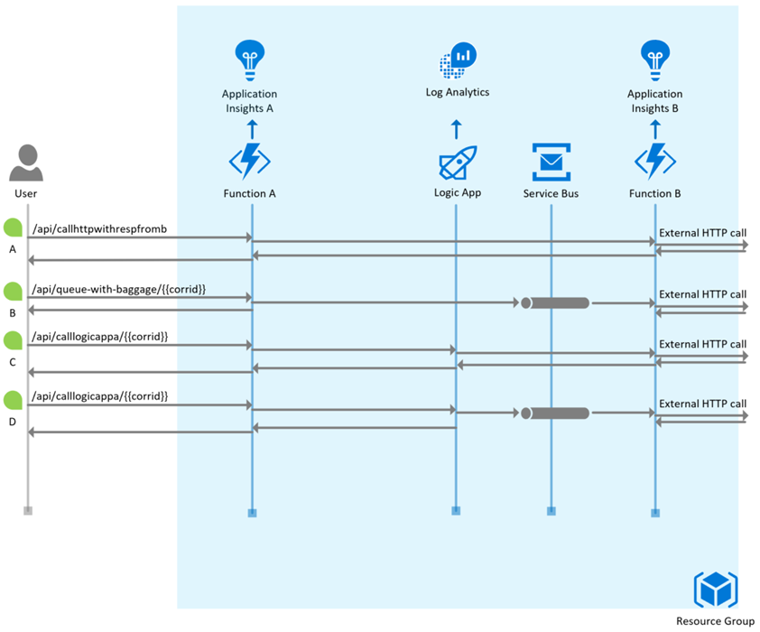
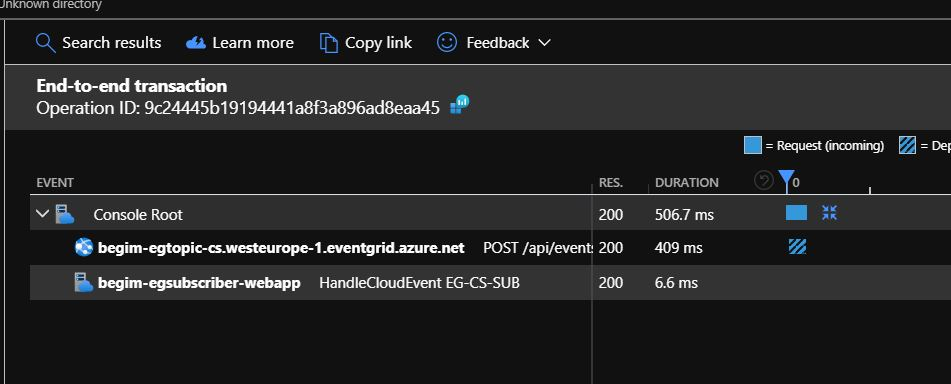

# Cross Component Correlation Playground

The Cross Component Correlation Playground is a setup which allows for testing a variety of distributed tracing scenarios across a number of components in Azure, amongst which:

- Functions
- Logic Apps
- Azure Service Bus
- Event Grid

It does so by providing real working examples and associated instructions for a number of distributed tracing scenarios.

## Scenarios

### **Scenario 1: App Insights and HTTP Calls**

Use either Function App A, or B with an HTTP invocation. The body of the function method then makes a GET call to [Request Bin](https://requestbin.com/) URL. Request Bin acts as a proxy and it's possible to observe through this the additional HTTP headers added for the purposes of correlation, by the App Insights SDK, to the outgoing HTTP call from the Azure function.

The interesting properties that appear as headers on the outbound HTTP call are:

| Header                   | Value                                                       | Comment                                          |
| ------------             | -----------------------------------                         | ------------------------------------             |
| **TraceParent**          | **00-2ba1dcbb920c0c489823e86ee57e557d-82c588a5d78c3f4a-00** | is the new W3C trace context                     |
| **Request-Id**           | **\|2ba1dcbb920c0c489823e86ee57e557d.82c588a5d78c3f4a.**    | is the older "request-id" mechanism              |
| **Request-Context**      | **appId=cid-v1:6b06625e-3d1f-4bb4-8b50-b22b20b5a6d6**       | represents the app id for AI A                   |
| X-Request-Id             | c39043fc-5693-4ca6-ba3c-56cf059acbad                        | NOT important to the discussion - IGNORE THIS    |

> Note: `X-Request-Id` is an older concept, originally intended to flow custom correlation id between client and server for HTTP calls.  It is not important to the discussion here.  Please ignore.
>
> An Application Id value is also returned in the response header request-context to a http function invocation
> Because this value is obtained (non blocking) by the runtime the first few calls may not return it.
> Ref https://github.com/microsoft/ApplicationInsights-dotnet-server/issues/504

... and what we see on App Insights:

Request telemetry item:

| Property                 | Value                                                   |
| ------------             | -----------------------------------                     |
| **OperationId**              | **2ba1dcbb920c0c489823e86ee57e557d**                |
| ParentId                 | 2ba1dcbb920c0c489823e86ee57e557d                        |
| Request-Id               | \|2ba1dcbb920c0c489823e86ee57e557d.509b52d5c4ba6145.    |
| (custom) HostInstanceId  | 0a57ccf6-58ea-4392-9da0-aaf0c043715a                    |
| (custom) InvocationId    | f860490b-30c2-4cb7-8688-10076b02ba7d                    |

Dependency telemetry item:

| Property                 | Value                                                   |
| ------------             | -----------------------------------                     |
| Remote Dependency Name   | GET /r/1ccpqtm1                                         |
| Operation Id             | 2ba1dcbb920c0c489823e86ee57e557d                        |
| Parent Id                | \|2ba1dcbb920c0c489823e86ee57e557d.509b52d5c4ba6145.    |
| **Dependency Id**        | **\|2ba1dcbb920c0c489823e86ee57e557d.82c588a5d78c3f4a.**    |
| (custom) HostInstanceId  | 0a57ccf6-58ea-4392-9da0-aaf0c043715a                    |
| (custom) InvocationId    | f860490b-30c2-4cb7-8688-10076b02ba7d                    |

#### **How this works**

This means that the dependency telemetry item's `Dependency Id` is set on the outbound HTTP call's `TraceParent` and `Request-Id` so it can be picked up by the receiver.  In addition to this parent/child relation, the identifier for the caller's App Insights resource (**appId**) is passed in the HTTP `Request-Context` header.  This is to enable cross-workspace discovery to power tooling with like the App Insights App Map experience.

> Note This mechasnism for flowing App Insights Resource information (AppId) only works for solicit response calls (e.g. HTTP) and will not work for calls which have Service Bus, or Event Grid in between to de-couple. Additional App Insights work will land somewhere around Q1CY20 to address this.

### **Scenario 2: Azure Function to Azure Service Bus**

'FunctionA' enqueues a message to Service Bus

- no custom correlation code in function
- no special configuration on Service Bus

#### The First Test

~~~ps

# Function: InitiateFlowToQueue

@submissionid = {{$guid}}
POST {{protocol}}://{{hosta}}/api/queue/{{submissionid}} HTTP/1.1

~~~

Submits an HTTP POST to the deployed Function App A - with a submission Id.

The submission id, a guid here, represents an identifier for the function activity. An example might be a shopping-cart-Id for an Azure function that performs stock check availability for an e-commerce application shopping cart.

The function logs the submission-id, adds it to the payload of the Service Bus Queue Message which will be output and finally tracks it against the Application Insights Request telemetry.

#### Recording custom telemetry on a function invocation's telemetry

Recording custom properties on the telemetry created during a function invocation is as easy as:

~~~cs
using System.Diagnostics;
// ...
Activity currActivity = Activity.Current;
currActivity.AddTag("MySubmissionId", submissionId);
~~~

Note: this records the custom property on the `request` telemetry item not on any dependency items this invocation created (this value does not appear on the dependency telemetry representing the Service Bus Enqueue call).

#### **Results**

Because both Functions Runtime v2.0 and Azure Service Bus support the required correlation headers this scenario will work out of box!

Searching in Application Insights for the Telemetry created during the function invocation shows:
- The Request to Azure function
- The Dependency (Service Bus)
- The log calls - piped as App Insights Trace Telemetry

Clicking the Request Telemetry items opens the "End to End" experience which defaults to a condensed view - showing the Request and the Dependency

Expanding this (show all) adds the trace telemetry items

The submission-id custom property (added as a System Diagnostic Activity Tag and read by App Insights SDK) along with the Operation Id and other key fields can be seen if you click through on a Telemetry item (remember to expand the initial condensed view of properties to see all).

#### The Second Test

Extending the first test, but now there is another function (Function App B) linked to another App Insights resource, which receives the message.

> Note: We have intentionally added an additional App Insights Resource for Function B to send its telemetry to. Today the App Insights view would be clearer if our multiple components sent to the same instrumentation-key (Resource) but some customers would see Service Bus as a logical boundary between different parts of an application (for example) so it's perfectly common for customers to use more than one Application Insights Resource across a distributed systems architecture.
Today this is not well supported in App Insight - [as documented here](https://docs.microsoft.com/en-us/azure/azure-monitor/app/custom-operations-tracking#queue-instrumentation). Work should land by Q1CY20 to ensure that App Insights can more easily detect where related Telemetry spans more than one App Insights Resource.

Like the first test, this second test has:

- No custom correlation code in function
- No special configuration on Service Bus

#### **Results**

Function B logs the invocation to App Insights but does not mention or show a correlation or dependency to the service bus queue or message
However, there IS a correlation to be found in the properties.  
Notice how the request on AI B has a `Parent Id` which is equal to AI A `Dependency Id`. The telemetry also shares Operation-id.

The Telemetry for Function A, App Insights A

The Telemetry for Function B, App Insights B - note the Parent-Id and Operation-Id of B matches the Operation-id and Dependency-id for A.

> Note: Submission-id is not recorded from Function B into App Insights other than by the trace of the message body which contains it.

#### **How this works**

Azure Functions records metadata on the service bus message, in particular:

- `$AzureWebJobsParentId` is set to the `InvocationId` of the dependency entry, which in turn is also the same as the request entry - as the InvocationId indicates the unique invocation identifier of the function.
- `Diagnostic-Id` is set to the `Dependency Id` of the dependency entry of the function which submitted the message
- Function B takes this `DiagnosticId` metadata and uses that as it's `Parent Id`

Note the [Service Bus Explorer](https://github.com/paolosalvatori/ServiceBusExplorer) Message Properties View here is indicative, the values do not match the test above.

### **Scenario 3: Event Grid**

Unlike the scenario with Service Bus, Event Grid does not flow distributed component correlation for App Insights or any other APM today. However, the preview [CloudEvents Schema](https://github.com/cloudevents/spec/blob/v1.0/spec.md) does support an [extension for trace properties](https://github.com/cloudevents/spec/blob/v1.0/extensions/distributed-tracing.md).

The Sample for Event Grid has the following components:

- Azure Event Grid Topic
- Net Core Console App to enqueue Events (this could have been a straight HTTP call but this misses information added by App Insights)
- ASP Net Core Web App which will host a Web Hook to receive the [CloudEvent (preview)](https://github.com/cloudevents/spec/blob/v1.0/spec.md) and is capable of showing both the incoming request headers and also provides the required HTTP OPTIONS verb implementation for the Event Grid validation Handshake (which differs from the usual Event Grid validation sequence).
- Event Grid Subscription for the Web Hook
- App Insights Resource for the Sender Console App and the Subscriber ASP Net App.

> Note: Event Grid requires [special configuration for Cloud Events](https://docs.microsoft.com/en-us/azure/event-grid/cloudevents-schema); a CLI extension and a specific Topic, Subscription and CloudEvent-Schema Message-payload with the receiving app implementing the HTTP Options based validation handshake.
>
> The ASP Net core App Event webhook used here is derived from this [Azure Event Viewer Sample](https://docs.microsoft.com/en-us/samples/azure-samples/azure-event-grid-viewer/azure-event-grid-viewer/).
> A proxy with scripting could also be used.

The console app begins by submitting a request telemetry item (this is a console app so there is no request pipeline for the AI SDK). The request telemetry item therefore represents the console app start.
Within this operation we then start a dependency telemetry / operation which will represent the Event Grid topic submission. It is worth noting that because the console app is configured with App Insights and the http dependency module, and becuse the post to the Topic is Http, we'll get an additional dependency from the SDK - but the purpose of our explicit dependency is to obtain the correct context to write into the event.

> In fact our dependency is created as a child operation of the request telemetry, we create our dependency passing in operation and request identifiers derived from the request operation context. 
> Not only this but the http dependency generated will also be a child of our dependency - see screen snip below.
>
> As with the functions we have the "submissionId" GUID which will represent context that we wish to "travel" with the related Telemetry.

~~~cs

  // start req operation
  var reqOp = _telemClient.StartOperation<RequestTelemetry>("ConsoleStart");
  var operationId = reqOp.Telemetry.Id.Replace("|", "").Split('.')[0];
  var requestId = reqOp.Telemetry.Id.Replace("|", "").Split('.')[1];

  var submissionId = Guid.NewGuid().ToString();
  
  // start dep operation
  var dependencyOperation = _telemClient.StartOperation<DependencyTelemetry>($"EventGridDependency", operationId, requestId );

  using (var httpClient = new HttpClient())
  {

      var cloudEvent = new CloudEvent<dynamic>(){
          SpecVersion = "1.0",
          Type="com.example.someevent",
          Source="MyContent",
          Id ="A234-1234-1234",
          Time = DateTime.UtcNow.ToString(),
          DataContentType = "application/json",
          Data=null,
          TraceParent = Activity.Current.Id,   //example "00-5c5031136bb4fc4ba327dca540e9e48c-455d7703d448dc42-00"
          TraceState=$"MySubmissionId={submissionId}"
      };
~~~

As AEG does not yet natively support App Insights correlation we have to ensure the operation and baggage are transmitted in the event body using the cloud event schema extension properties that exist for this reason. You can see the "submission id" guid is mapped ot the "TraceState" (this can be a comma delimited list of key=values). You can also see that the "TraceParent" is set from the current activity. This in turn is set from the AI operations scope we've created (with the start operations calls).

> Note the form of the "traceparent" payload (an example of which is in the comment). Ignoring the first and last part (which are flags) the first, longer value , is the operation id, the send the request id for the current activity.

Here's the Telemetry for the Console App as traced in App Insights

Note the relationship - our dependency doesn't get set a "type" so appears as "other".
The HTTP dependency (which was automatically created) is typed.
Clicking through the dependencys you will notice the request id for the parent is the parent-id for the child.
The last thing to note is the "HandleCloudEvent EG-CS-SUB" request telemetry.

Where does this request-telemetry come from? 
This comes from the api we deployed which subscribes to the event we've just sent.

~~~cs
var op = _telemClient.StartOperation<RequestTelemetry>($"HandleCloudEvent {AEGSubscriptionName}", details.TraceParent.Split('-')[1], details.TraceParent.Split('-')[2]);
~~~

Note that we've de-serialized the event payload ("details" variable) and we're unpacking the value in the "traceparent" field set in the context app and using the operation id (the second value) and the request id (the third value) as the parent. This is what causes the "handlecloudevent...." telemetry in the screen snip above to be a child of the telemetry for the event submission.

> Note: Today this only renders in the end-to-end view this way because both console app and subscriber app write to the same app insights resource. Also note the "duration" is incorrect. This is because we're not setting the operation start and stop correctly.

### << begim TO EDIT below this point >>

Fn A -> Service Bus -> Fn B (with custom code to correlate across workspaces using a custom correlation id)

When using the `Activity` class to add custom properties to the recorded telemetry, one can also use the `Activity Baggage` to indicate any information to be passed on to all dependencies.  To pass on a custom property to a dependency:

~~~cs
  using System.Diagnostics;
  // ...
  Activity currActivity = Activity.Current;
  currActivity.AddBaggage("MySubmissionIdThroughBagage", submissionId);
~~~

Note how the call to `Activity.AddTag(..)` did _not_ result in anything being recorded on the dependency telemetry item.  Also, when used in our Function to enqueue an item, the metadata on that item would not show those tags.  This is different for `Activity.AddBagage`.  The enqueued message in this case, shows metadata like

| Property                 | Value                                                               |
| ------------             | -----------------------------------                                 |
| Correlation-Context      | MySubmissionIdThroughBagage=bec20faa-9fa1-4dfc-a081-9b32a52dbdac    |

This mechanism works: 
- despite that the Functions ServiceBus binding does not call into App Insights directly (it just uses the Service Bus SDK)
- despite the fact that the Service Bus SDK does not know anything about our application context

On the side of App Insights, for the request telemetry item nothing will have changed but the following is what we see for the dependency telemetry item:

| Property                                  | Value                                   |
| ------------                              | -----------------------------------     |
| (custom) MySubmissionIdThroughBagage      | bec20faa-9fa1-4dfc-a081-9b32a52dbdac    |

What if FunctionB now picks up this message from the queue?  This mechanism will propagate this property to the receiving invocating for FunctionB, which (thanks to the Service Bus SDK) will record the very same property in its request telemetry item:

| Property                                  | Value                                   |
| ------------                              | -----------------------------------     |
| (custom) MySubmissionIdThroughBagage      | bec20faa-9fa1-4dfc-a081-9b32a52dbdac    |

Even beyond this... if FunctionB does an outbound HTTP calls, that custom metadata will also travel in the headers of such outbound call.

> **Note**: the App Insights treeview and app map will still _not_ show a consolidated view out of the box when _just_ doing Fn A -> SvcBus -> Fn B.  It has no idea which workspaces to link up.  However, as soon as one does an HTTP call from Fn A to Fn B, the **appId** of both workspaces are exchanged and App Insights will start lighting up the consolidated experience!  Like this:
>
> 

### Using Kusto to correlate items with a custom correlation ID

You could write a Kusto query as below to find telemetry with a custom correlation ID, within a single App Insights component/workspace:

~~~kusto
(requests | union dependencies | union pageViews)
| extend MyCustomCorrId = tostring(customDimensions.MyCustomCorrId) 
| where  MyCustomCorrId == "7d767f42-3e80-4e4e-9d40-44edb59af6f3"
~~~

To do the same across workspaces, [see the documentation for this](https://docs.microsoft.com/en-us/azure/azure-monitor/log-query/cross-workspace-query#identifying-an-application).  This could look something like:

~~~kusto
let allApps = union app('aicorr-fn-appinsights-a').requests, app('aicorr-fn-appinsights-b').requests,
              app('aicorr-fn-appinsights-a').dependencies, app('aicorr-fn-appinsights-b').dependencies,
              app('aicorr-fn-appinsights-a').exceptions, app('aicorr-fn-appinsights-b').exceptions,
              app('aicorr-fn-appinsights-a').traces, app('aicorr-fn-appinsights-b').traces,
              app('aicorr-fn-appinsights-a').customEvents, app('aicorr-fn-appinsights-b').customEvents;
allApps
| extend MyCustomCorrId = tostring(customDimensions.MyCustomCorrId) 
| where  MyCustomCorrId == "7d767f42-3e80-4e4e-9d40-44edb59af6f3"
| order by timestamp asc
~~~

- notice how the very first function call is _not_ present; which is because we only set the baggage _within_ that activity, when it already started.  Any activities that started after we set the baggage got the custom correlation id stamped on them and as such are retrieved by the query
- to mitigate this, you'll want to stamp the original request with a tag, in additional to the baggage, like the below.  The above query would not need to be changed for this.

~~~cs
currActivity.AddTag("MyCustomCorrId", submissionId);
~~~

### Function -> Logic App (no custom modifications)

When function A makes a call to logic App A, the logic app manual trigger (called through an HTTP POST) will have access to the inbound headers, which it will see like:

~~~json
{
    "headers": {
        "Host": "prod-105.westeurope.logic.azure.com",
        "Request-Context": "appId=cid-v1:fe4dae78-eae7-4f13-b3d3-110cc0753f65",
        "traceparent": "00-bb375af0c4f6a24ab36915f13be7d08d-334f3f2baa66b042-00",
        "Request-Id": "|bb375af0c4f6a24ab36915f13be7d08d.334f3f2baa66b042.",
        "Content-Length": "0"
    }
}
~~~

Out of box, the logic app does nothing to put a valid correlation in Log Analytics which is usable to tie both the Function and Logic App traces together.

### Function -> Logic App (custom property tracking)

We can modify the logic app so that a custom property gets tracked.  
For more information, see here: https://docs.microsoft.com/en-us/azure/logic-apps/logic-apps-monitor-your-logic-apps#azure-diagnostics-event-settings-and-details

#### Querying Log Analytics for custom tracked properties

In Log Analytics, you can query for `ActionCompleted` events where the tracked properties are stored:

~~~kusto
AzureDiagnostics
| where OperationName == "Microsoft.Logic/workflows/workflowActionCompleted" 
~~~

#### Extracting custom tracked properties in a column using Log Analytics

In order to extract tracked properties, a query like the below can be used:

~~~kusto
workspace('{logAnalytics}').AzureDiagnostics
| where OperationName == "Microsoft.Logic/workflows/workflowActionCompleted"
| parse kind = regex trackedProperties_Correlation_Context_s with * "MyCustomCorrId=" CustomCorrId:string
| project-reorder  CustomCorrId, trackedProperties_Correlation_Context_s
~~~

#### Correlating all Logic Apps Actions when correlation ids are just tracked on a single Action

In the end, one will want to retrieve the telemetry for all Logic Apps action that belong to the same run, even if custom tracked (correlation) properties were just tracked on a single action.

The raw logic apps diagnostics table looks like this:

~~~kusto
let LogicAppsDiagsRaw = 
  workspace('{logAnalytics}').AzureDiagnostics
  | project-reorder startTime_t, status_s, OperationName, trackedProperties_Correlation_Context_s, trackedProperties_Request_Id_s, resource_runId_s;
LogicAppsDiagsRaw
~~~

As demonstrated by above picture, there is only some entries that have a `trackedProperties_Correlation_Context_s` or `trackedProperties_Request_Id_s`.  Eventually though, one will want to be able to query for all the Logic Apps Actions that belong to the same run which is associated with a given correlation id.  In this example, that correlation id however is only tracked by a single activity within the run.  This means we'll need to find a way to "stamp" those correlation identifiers on all action telemetry.

First, we'll need to:
- look at the `workflowActionCompleted` entries which are the only ones which have tracked properties stored upon them
- then extract our custom correlation id from the Correlation Context column
- we'll also want to have an `id` column which uniquely identifies each Action
- finally we'll want to have a `operation_ParentId` similar to the output we typically see from App Insights so it becomes easier to union these tables later on

Like this:

~~~kusto
let LogicAppsActionCompletedDiag = 
  LogicAppsDiagsRaw
  | where OperationName == "Microsoft.Logic/workflows/workflowActionCompleted"
  | parse kind = regex trackedProperties_Correlation_Context_s with * "MyCustomCorrId=" MyCustomCorrId:string
  | extend id=resource_runId_s
  | project-rename operation_ParentId=trackedProperties_Request_Id_s
  | project-reorder  MyCustomCorrId, operation_ParentId, trackedProperties_Correlation_Context_s;
LogicAppsActionCompletedDiag
~~~

Now, we first create a lookup table, which maps each Logic App Run identifier to our custom correlation id and the `operation_ParentId` (which is coming from `trackedProperties_Request_Id_s`).  As follows:

~~~kusto
let MyCustomCorrIdMappingToResourceRunId = 
  LogicAppsActionCompletedDiag | where MyCustomCorrId != '' | distinct MyCustomCorrId, resource_runId_s, operation_ParentId;
MyCustomCorrIdMappingToResourceRunId
~~~

If we now have a `resource_runId_s` (which is available on every Action telemetry row), we can easily look up both the associated custom correlation id _and_ the `operation_ParentId`.  We can easily do this using the `lookup` function, for every single row in the raw Logic Apps Diagnostics table:

~~~kusto
let LogicAppsDiagsWithCustomCorrIdStamped = 
  LogicAppsDiagsRaw
  | lookup kind=leftouter MyCustomCorrIdMappingToResourceRunId on resource_runId_s
  | project-reorder MyCustomCorrId, resource_runId_s, trackedProperties_Correlation_Context_s, operation_ParentId, trackedProperties_Request_Id_s;
LogicAppsDiagsWithCustomCorrIdStamped
~~~

With a bit more ordering and cosmetics the entire query looks like this:

~~~kusto
let LogicAppsDiagsRaw = 
  workspace('{logAnalytics}').AzureDiagnostics
  | project-reorder startTime_t, status_s, OperationName, trackedProperties_Correlation_Context_s, trackedProperties_Request_Id_s, resource_runId_s;
let LogicAppsActionCompletedDiag = 
  LogicAppsDiagsRaw
  | where OperationName == "Microsoft.Logic/workflows/workflowActionCompleted"
  | parse kind = regex trackedProperties_Correlation_Context_s with * "MyCustomCorrId=" MyCustomCorrId:string
  | extend id=resource_runId_s
  | project-rename operation_ParentId=trackedProperties_Request_Id_s
  | project-reorder  MyCustomCorrId, operation_ParentId, trackedProperties_Correlation_Context_s;
let MyCustomCorrIdMappingToResourceRunId = 
  LogicAppsActionCompletedDiag | where MyCustomCorrId != '' | distinct MyCustomCorrId, resource_runId_s, operation_ParentId;
let LogicAppsDiagsWithCustomCorrIdStamped = 
  LogicAppsDiagsRaw
  | lookup kind=leftouter MyCustomCorrIdMappingToResourceRunId on resource_runId_s
  | project-reorder MyCustomCorrId, resource_runId_s, trackedProperties_Correlation_Context_s, operation_ParentId, trackedProperties_Request_Id_s;
let AllLogicActionsWithFilledCorrelationIds =
  LogicAppsDiagsWithCustomCorrIdStamped
  | extend id=resource_runId_s
  | project-reorder  MyCustomCorrId, operation_ParentId, resource_runId_s, operation_ParentId, trackedProperties_Correlation_Context_s;
AllLogicActionsWithFilledCorrelationIds
~~~

## Visualization using Log Analytics Workbooks

Where the built-in visualization and default queries of both Log Analytics and App Insights might fall a bit short for doing end to end correlation across a variety of resource types, Log Analytics Workbooks might be able to help.

### Using a treeview to visualize distributed traces across App Insights resources

Using a query like this:

~~~kusto
let allApps = union app('{appInsightsA}').requests, app('{appInsightsB}').requests,
              app('{appInsightsA}').dependencies, app('{appInsightsB}').dependencies,
              app('{appInsightsA}').exceptions, app('{appInsightsB}').exceptions,
              app('{appInsightsA}').traces, app('{appInsightsB}').traces,
              app('{appInsightsA}').customEvents, app('{appInsightsB}').customEvents;
allApps 
  | extend MyCustomCorrId = tostring(customDimensions.MyCustomCorrId) 
  | extend message_or_name = strcat(message, name)
  | extend id = iif(id == '', tostring(new_guid()), id) // make sure id is unique (if not table will not be displayed correctly)
  | where  MyCustomCorrId == "{corrid}"
  | project-reorder timestamp, itemType, id, operation_ParentId, message_or_name, appId
  | project-away problemId, handledAt, assembly, method, outerType, outerMessage, outerAssembly, outerMethod, innermostType, innermostMessage, innermostAssembly, innermostMethod, client_City, client_StateOrProvince, client_CountryOrRegion, client_Browser, cloud_RoleName, cloud_RoleInstance, client_Model, client_OS, operation_SyntheticSource, session_Id, user_Id, user_AuthenticatedId, user_AccountId, application_Version, client_Type, message, name
  | order by timestamp asc;
~~~

and configuring the workbook to visualize the table columns as follows:

will provide us with the ability to see a full treeview of our distributed trace.  In this particular case, we're looking at a trace that spans:
- a request coming in on Function App A
- which sends a message to Service Bus
- which gets picked up by Function App B
- which does an HTTP call to some external system

### Extending a distributed trace treeview with Action telemetry from Logic Apps

Building upon the previous treeview, we can extend our query to include data from Logic Apps.

~~~kusto
let allApps = union app('{appInsightsA}').requests, app('{appInsightsB}').requests,
              app('{appInsightsA}').dependencies, app('{appInsightsB}').dependencies,
              app('{appInsightsA}').exceptions, app('{appInsightsB}').exceptions,
              app('{appInsightsA}').traces, app('{appInsightsB}').traces,
              app('{appInsightsA}').customEvents, app('{appInsightsB}').customEvents;
let LogicAppsDiagsRaw = 
  workspace('{logAnalytics}').AzureDiagnostics
  | project-reorder startTime_t, status_s, OperationName, trackedProperties_Correlation_Context_s, trackedProperties_Request_Id_s, resource_runId_s;
let LogicAppsActionCompletedDiag = 
  LogicAppsDiagsRaw
  | where OperationName == "Microsoft.Logic/workflows/workflowActionCompleted"
  | parse kind = regex trackedProperties_Correlation_Context_s with * "MyCustomCorrId=" MyCustomCorrId:string
  | extend id=strcat(resource_runId_s, Resource, OperationName)
  | project-rename operation_ParentId=trackedProperties_Request_Id_s
  | project-reorder  MyCustomCorrId, operation_ParentId, trackedProperties_Correlation_Context_s;
let MyCustomCorrIdMappingToResourceRunId = 
  LogicAppsActionCompletedDiag | where MyCustomCorrId != '' | distinct MyCustomCorrId, resource_runId_s, operation_ParentId;
let LogicAppsDiagsWithCustomCorrIdStamped = 
  LogicAppsDiagsRaw
  | lookup kind=leftouter MyCustomCorrIdMappingToResourceRunId on resource_runId_s
  | project-reorder MyCustomCorrId, resource_runId_s, trackedProperties_Correlation_Context_s, operation_ParentId, trackedProperties_Request_Id_s;
let AllLogicActionsWithFilledCorrelationIds =
  LogicAppsDiagsWithCustomCorrIdStamped
  | extend id=strcat(resource_runId_s, Resource, OperationName), timestamp=startTime_t
  | project-reorder  MyCustomCorrId, operation_ParentId, resource_runId_s, trackedProperties_Correlation_Context_s;
let fullTreeView =
  allApps 
  | extend MyCustomCorrId = tostring(customDimensions.MyCustomCorrId) 
  | extend message_or_name = strcat(message, name)
  | union (
     AllLogicActionsWithFilledCorrelationIds
     | extend itemType = 'workflowAction'
     | extend message_or_name = strcat(trim_start('Microsoft.Logic/workflows/workflow', OperationName), ' - ', Resource, ' ', error_message_s)
  )
  | where  MyCustomCorrId == "{corrid}"
  | extend id = iif(id == '', tostring(new_guid()), id) // make sure id is unique (if not table will not be displayed correctly)
  | project-reorder timestamp, itemType, id, operation_ParentId, message_or_name, appId
  | project-away problemId, handledAt, assembly, method, outerType, outerMessage, outerAssembly, outerMethod, innermostType, innermostMessage, innermostAssembly, innermostMethod, client_City, client_StateOrProvince, client_CountryOrRegion, client_Browser, cloud_RoleName, cloud_RoleInstance, client_Model, client_OS, operation_SyntheticSource, session_Id, user_Id, user_AuthenticatedId, user_AccountId, application_Version, client_Type, message, name
  | order by timestamp asc;
fullTreeView
~~~

## Reference - how does correlation work

See:

- https://docs.microsoft.com/en-us/azure/azure-monitor/app/auto-collect-dependencies
- https://docs.microsoft.com/en-us/azure/azure-monitor/app/correlation
- http://apmtips.com/blog/2017/10/18/two-types-of-correlation/
- https://dev.applicationinsights.io/
- https://devblogs.microsoft.com/aspnet/improvements-in-net-core-3-0-for-troubleshooting-and-monitoring-distributed-apps/
- https://docs.microsoft.com/en-us/azure/logic-apps/logic-apps-monitor-your-logic-apps#azure-diagnostics-event-settings-and-details
